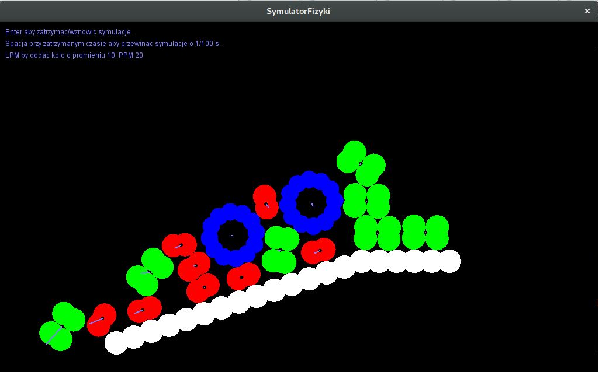

# Symulator fizyki 2013
Jest to stworzony przeze mnie w 2013 symulator zderzeń fizycznych.

## Kompilacja
Udało mi się go skompilować z
```
gcc version 5.4.0 20160609 (Ubuntu 5.4.0-6ubuntu1~16.04.5)
```
###Dodatkowe biblioteki
```bash
sudo add-apt-repository ppa:allegro/5.2
sudo apt-get update
sudo apt-get install liballegro5-dev
```

## Opis
Symulator opiera się na impulsach, kolizjach które zachodzą w jednym momencie i przez popęd siły są obliczane nowe wartości prędkości postępowych i obrotowych.

## Obrazki

